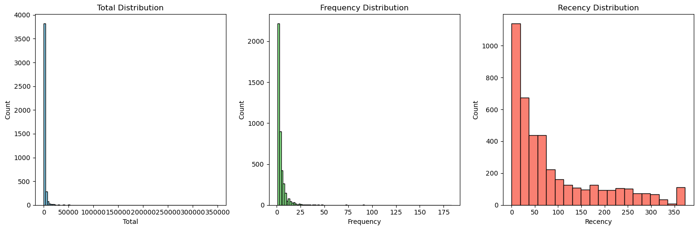
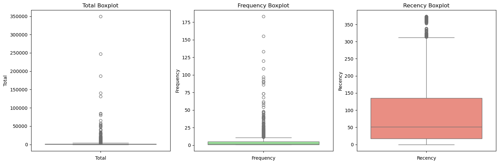
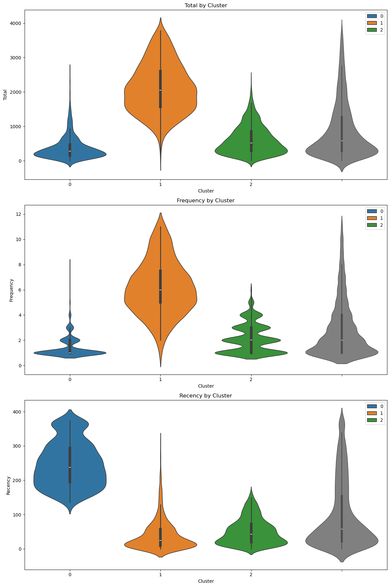
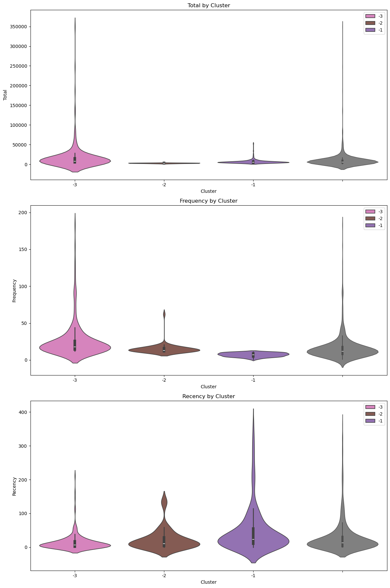
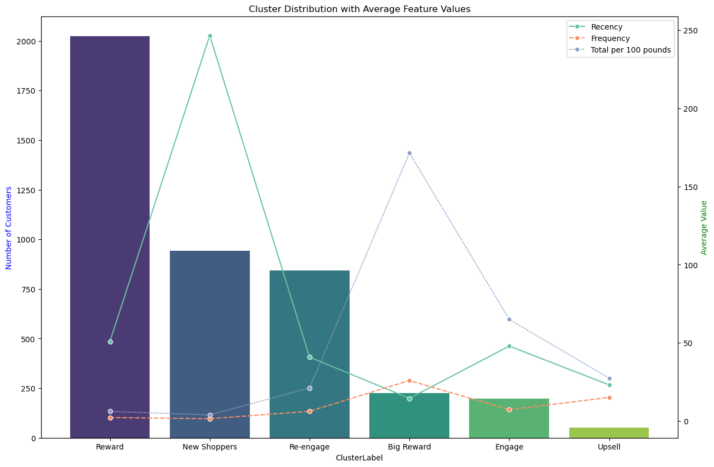

# Online Retail Client Clustering

This project applies RFM analysis and KMeans clustering to transactional data from a UK-based online retailer specialising in giftware, covering the period from December 2009 to December 2010. The dataset contains 525,461 raw transactions. After cleaning, 406,309 records remained, representing 77.3% of the original data. The goal is to segment customers into actionable groups and propose tailored business strategies for each segment.

---

## Dataset

The dataset is sourced from the [UCI Machine Learning Repository](https://archive.ics.uci.edu/ml/index.php) and contains the following fields: invoice number, stock code, product description, quantity, invoice date, unit price, customer ID, and country. Two observations from the raw data are relevant upfront: Customer ID has a significant number of missing values (107,927 out of 525,461 rows), and both quantity and price contain negative values that require investigation before any analysis.

---

## Data Cleaning

The cleaning pipeline was built around two guiding principles: be explicit about every exclusion decision, and verify assumptions against the actual data rather than accepting the dataset description at face value.

**Invoice filtering.** Invoices starting with "C" indicate cancellations (negative quantities). Invoices starting with "A" are accounting adjustments (three records with prices of -$53,594, -$44,031, and -$38,925) that have nothing to do with real transactions. Both were removed by filtering to invoices matching exactly six digits via regex.

**Stock code filtering.** The dataset description states stock codes should be five digits, but 80,112 rows deviate from this. Rather than excluding them all, each non-standard code was investigated individually. Codes representing postage (POST, DOT), discounts (D), manual adjustments (M, m), bank charges (BANK CHARGES, B), test products (TEST001, TEST002), gift vouchers (gift\_0001\_XX), accounting entries (ADJUST, ADJUST2), Amazon fees (AMAZONFEE), and samples (S) were all excluded. The only non-standard code retained was PADS, which appears to be a legitimate product line. The decision is documented in the notebook for each code explicitly.

**Missing Customer IDs.** Rows with missing Customer ID were excluded. Imputation is not possible here: there is no reliable way to assign a customer to an anonymous transaction, and the RFM analysis requires customer-level aggregation.

**Zero prices.** Items with a price of zero were excluded from the analysis. They appear to represent samples or internal transfers rather than commercial transactions, and including them would distort the monetary component of RFM.

After all filters, 406,309 records and 77.3% of the original dataset were retained.

---

## Feature Engineering: RFM

Customer behaviour was summarised into three dimensions, aggregated at the customer level:

- **Total (Monetary):** the sum of quantity multiplied by unit price across all transactions for a given customer. This is computed at the line-item level (SalesTotal = Quantity x Price) before aggregating.
- **Frequency:** the number of distinct invoices per customer. Using unique invoice count rather than total line items avoids inflating frequency for customers who buy many products in a single visit.
- **Recency:** the number of days between a customer's most recent purchase and the last date in the dataset (December 9, 2010). A lower recency means a more recently active customer.

---

## Outlier Analysis

The distributions of Total and Frequency are heavily right-skewed: most customers cluster at low values, but a small number of high-spending or high-frequency buyers produce extreme outliers. These are not errors; they are the most commercially valuable customers. Removing them from the clustering pool is not about discarding them but about preventing them from distorting the centroid positions for everyone else.

Outliers were identified using the standard IQR method (1.5 x IQR beyond Q3) separately for Total and Frequency. This produced three overlapping groups:

- **Total-only outliers:** 423 customers, mean spend of £12,188, mean recency of 30 days.
- **Frequency-only outliers:** 279 customers, mean of 23.8 purchases, mean recency of 16 days.
- **Total and Frequency outliers (both):** customers exceeding both thresholds simultaneously, representing the highest-value segment.

After removing all outlier customers, 3,809 customers remained for KMeans clustering.

---

## Clustering: Non-Outlier Customers

### Scaling

The three RFM features operate on very different scales: Total ranges from £1.55 to £3,788, Frequency from 1 to 11, and Recency from 0 to 373 days. Without scaling, Total would dominate the distance calculations in KMeans purely due to its larger numeric range. Standard scaling was applied to transform each feature to mean 0 and standard deviation 1:

$$z = \frac{x - \mu}{\sigma}$$

This ensures all three dimensions contribute equally to the clustering geometry.

### Choosing k

KMeans was run for k from 2 to 20. Two criteria were used to select k:

- **Inertia (elbow method):** inertia decreases as k increases but the rate of improvement diminishes past a certain point. The elbow occurs around k = 3 to 4.
- **Silhouette score:** peaks at k = 3 with a score of 0.46, indicating that three clusters produce the most distinct and internally cohesive groupings. Beyond k = 3, scores decline consistently.

k = 3 was selected based on the convergence of both criteria.

### Silhouette Score

The silhouette score for a single observation $i$ is defined as:

$$s(i) = \frac{b(i) - a(i)}{\max(a(i), b(i))}$$

where $a(i)$ is the mean distance between $i$ and all other points in the same cluster, and $b(i)$ is the mean distance between $i$ and all points in the nearest neighbouring cluster. The score ranges from -1 to 1; a higher value indicates the observation is well-matched to its own cluster and clearly separated from others.

### Cluster Profiles

| Cluster | Label | Total (mean) | Frequency (mean) | Recency (mean days) |
|---|---|---|---|---|
| 0 (Blue) | New Shoppers | Low | Low | High |
| 1 (Orange) | Re-engage | High | High | Very low |
| 2 (Green) | Reward | Medium | Medium | Low |

**Cluster 0 (New Shoppers).** Low spend, low frequency, and relatively high recency. These are likely recent first-time customers who are still exploring. The priority is conversion: first-impression customer service, onboarding incentives, and early-purchase promotions to move them toward repeat buying.

**Cluster 1 (Re-engage).** High historical spend and frequency but very low recency, meaning they were active customers who have gone quiet. The recency distribution for this cluster is tightly concentrated near zero, which is counterintuitive at first glance but reflects that the orange cluster captures customers who purchased frequently and recently stopped, not customers who never came back. The action is targeted re-engagement: personalised campaigns, win-back discounts, and product update newsletters.

**Cluster 2 (Reward).** Consistent, average purchasers whose behaviour aligns with the population mean across all three dimensions. This is the largest segment and the core of the customer base. The strategy is retention: a loyalty programme, exclusive offers, and early product access to prevent churn.

---

## Outlier Segmentation

The 476 outlier customers were segmented manually into three groups rather than running KMeans on them. The reason is practical: KMeans needs sufficient data to estimate centroids reliably, and the outlier groups are small enough and distinct enough in their characteristics to be labelled directly.

| Cluster | Label | Characteristics | Strategy |
|---|---|---|---|
| -1 (Purple) | Engage | High spend, low-to-moderate frequency | Personalised offers; luxury or premium service tiers |
| -2 (Brown) | Upsell | High frequency, moderate spend per visit | Bundle deals and loyalty incentives to increase basket size |
| -3 (Pink) | Big Reward | Extreme spend and frequency | VIP programme; exclusive early access; dedicated account management |

The Big Reward segment is the most commercially critical. Their numbers are small (making personalised handling feasible) and their contribution to total revenue disproportionately large. The Upsell segment is the lowest priority: frequent engagement at low spend means the relationship already exists, but the margin opportunity per visit is limited.

---

## Key Findings

The majority of customers fall into the Reward segment: consistent, average buyers who represent stable recurring revenue. The Re-engage segment is roughly as large as New Shoppers, which signals that acquisition is keeping pace with churn but that churn is not being actively addressed. The Big Reward outliers are commercially irreplaceable and small enough to manage individually. Recency is the most discriminating feature across clusters; customers who have gone quiet are the clearest signal of a retention problem that generic marketing will not solve.
